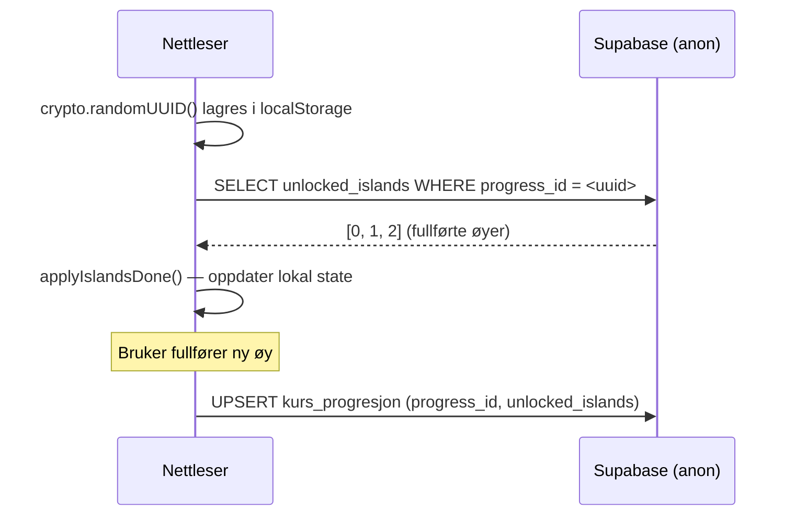
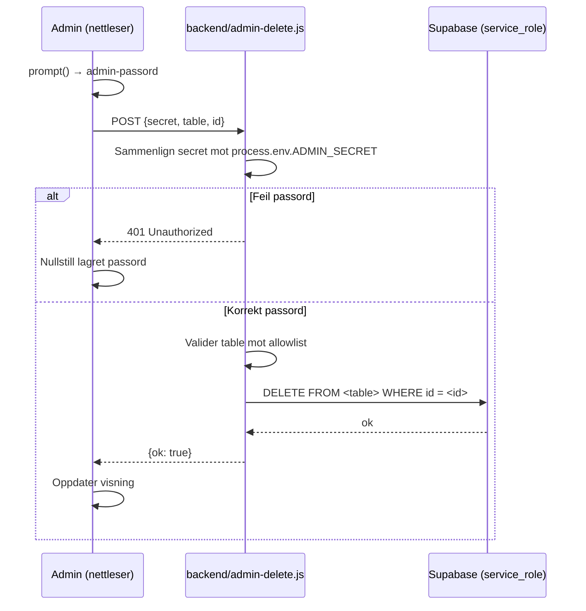
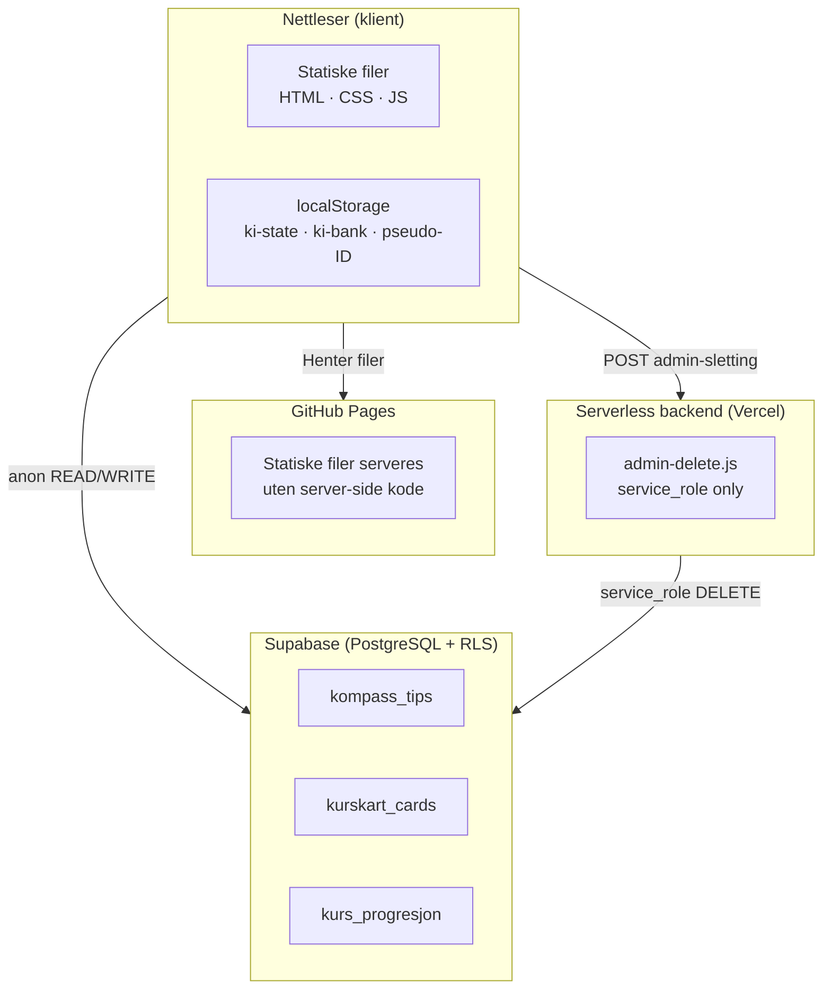
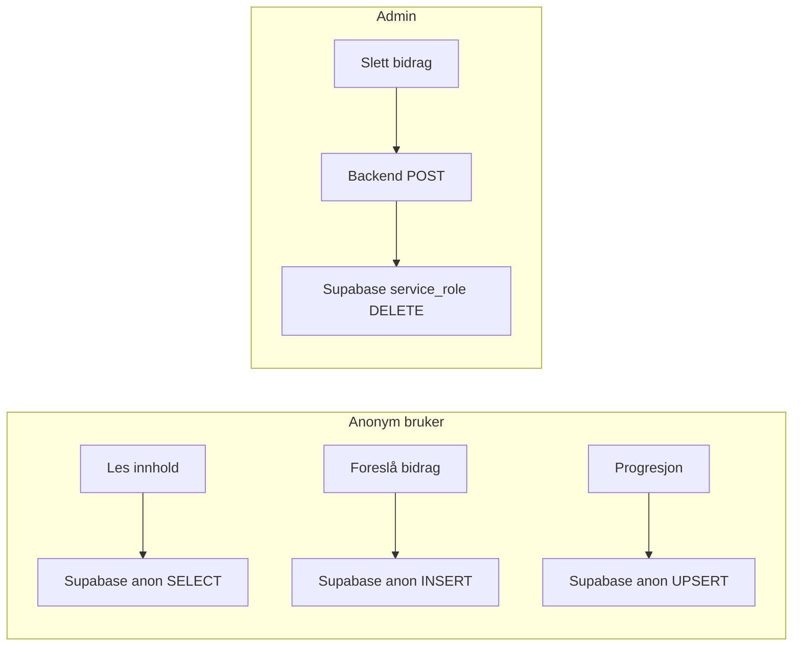

# KI i klasserommet — Arkitekturbeskrivelse

> Teknisk kildedokument for utviklere, arkitekter og fagansvarlige.  
> Versjon 3 · April 2026

---

## 1. Systemoversikt

**KI i klasserommet** er et nettbasert kursverktøy for lærere i videregående skole. Systemet hjelper lærere med å ta i bruk Microsoft Copilot gjennom fire moduler:

| Modul | Fil | Formål |
|---|---|---|
| Kurskartet | `index.html` | Interaktivt øykart med prompt-kort organisert etter tema |
| Veiviseren | `veiviser.html` | Stegbasert skjema som genererer Copilot-prompt fra fagdata |
| Min bank | `min-bank.html` | Personlig prompt-bibliotek lagret lokalt |
| Kompasset | `kompasset.html` | Veiledningsportal med kategoriserte tips og ressurser |

Systemet er primært en **statisk nettside** uten byggprosess, hostet på GitHub Pages. I versjon 3 er det lagt til en valgfri tilkobling til **Supabase** for delt innhold, anonym progresjonssporing og moderert brukerbidrag. En minimal **serverless backend** håndterer admin-sletting med rettigheter på serversiden.

---

## 2. Ansvarsfordeling: frontend vs. backend

```
┌──────────────────────────────────────────────────┐
│  FRONTEND (statiske filer – GitHub Pages)         │
│                                                   │
│  • All presentasjonslogikk og navigasjon          │
│  • Lesing av delt innhold fra Supabase (anon)     │
│  • Skriving av brukerforslag til Supabase (anon)  │
│  • Anonym progresjonssporing (pseudo-ID)          │
│  • Admin-UI (PIN-beskyttet)                       │
│                                                   │
│  Kan IKKE:                                        │
│  • Slette data fra Supabase (RLS blokkerer)       │
│  • Bruke service_role-nøkkelen                    │
└────────────────────┬─────────────────────────────┘
                     │ POST (admin-sletting)
                     ▼
┌──────────────────────────────────────────────────┐
│  BACKEND-ENDEPUNKT (Vercel / Node serverless)     │
│                                                   │
│  • Verifiserer ADMIN_SECRET mot env-variabel      │
│  • Validerer tabellnavn mot allowlist             │
│  • Utfører DELETE via Supabase service_role       │
│                                                   │
│  Nøkkelen (service_role) finnes ALDRI i klient    │
└────────────────────┬─────────────────────────────┘
                     │ DELETE (service_role)
                     ▼
┌──────────────────────────────────────────────────┐
│  SUPABASE (PostgreSQL + Row Level Security)       │
│                                                   │
│  Tabeller:                                        │
│  • kompass_tips       – delte tips i Kompasset    │
│  • kurskart_cards     – delte kort i Kurskartet   │
│  • kurs_progresjon    – anonym øy-progresjon      │
└──────────────────────────────────────────────────┘
```

---

## 3. Supabase — tabeller, RLS og anon-nøkkel

### 3.1 Tabeller

| Tabell | Skriver hvem | Leser hvem | Slettes av |
|---|---|---|---|
| `kompass_tips` | Alle (anon) | Alle (anon) | Admin via backend |
| `kurskart_cards` | Alle (anon) | Alle (anon) | Admin via backend |
| `kurs_progresjon` | Anon (eget pseudo-ID) | Anon (eget pseudo-ID) | — |

### 3.2 RLS-modell

Alle tabeller har Row Level Security aktivert med følgende policy-prinsipp:

- **INSERT / SELECT:** Tillatt for alle (`anon`-rollen) — ingen autentisering kreves
- **DELETE:** Blokkert for alle fra klienten — kun mulig via `service_role` på backend
- **UPDATE:** Kun tillatt for `kurs_progresjon` der `progress_id = progress_id` (bruker kan oppdatere sin egen rad)

### 3.3 Anon-nøkkel

`supabase-client.js` inneholder kun den **publishable anon-nøkkelen**. Denne er trygg å eksponere i kildekode: den gir kun de rettighetene RLS-policyene tillater. `service_role`-nøkkelen eksponeres aldri i frontend.

```js
// supabase-client.js — kun anon-nøkkel, aldri service_role
export const supabase = createClient(SUPABASE_URL, SUPABASE_ANON_KEY);
```

### 3.4 Feature flags

Supabase-funksjonalitet styres av feature flags i `config.js`:

```js
supabase: {
  enableRead:        false,  // Les delt innhold fra Supabase
  enableWrite:       false,  // Skriv brukerforslag til Supabase
  enableProgression: false   // Lagre øy-progresjon i Supabase
}
```

Alle flags er `false` som standard. Ingen Supabase-kall skjer uten eksplisitt aktivering. Statiske data fra `data.js` og `kompasset-data.js` brukes alltid som fallback.

---

## 4. Anonyme brukere og fravalg av autentisering

Systemet har **ingen innlogging**. Dette er et bevisst valg begrunnet i:

1. **Målgruppen** — lærere i ulike kommuner og nettverk. Å kreve konto ville lagt til friksjon uten å gi vesentlig verdi for den pedagogiske bruken.
2. **Personvern** — uten innlogging samles ingen persondata. Alle operasjoner er knyttet til et tilfeldig pseudo-ID, ikke til en person.
3. **Vedlikeholdsbelastning** — ingen brukeradministrasjon, ingen passordhåndtering, ingen GDPR-prosessor-avtalehåndtering.
4. **Skalerbarhet** — løsningen kan brukes på tvers av skoler og kommuner uten sentralisert brukerdatabase.

Konsekvensen er at innholdet alle brukere bidrar med er **åpent for alle** — dette er akseptabelt fordi Kompasset og Kurskart er modererte portalverktøy, ikke personlige arbeidsflater.

---

## 5. Progresjon med pseudo-ID

Kurskart-progresjon knyttes til et **anonymt pseudo-ID** generert én gang per nettleser:

```js
window.getProgressId = () => {
  let id = localStorage.getItem('ki-progress-id');
  if (!id) { id = crypto.randomUUID(); localStorage.setItem('ki-progress-id', id); }
  return id;
};
```

Flyten når `enableProgression: true`:



**Begrensninger som følge av anonym modell:**
- Progresjon er per nettleser, ikke per person — slettes med nettleserdata
- Ingen synkronisering mellom enheter
- Ingen uthenting av «hvem som har gjort hva»

Dette er akseptert: verktøyet er ment for undervisningssituasjonen, ikke som et LMS med rapportering.

---

## 6. Admin-moderering via backend og service_role

Brukere kan foreslå tips (Kompasset) og kort (Kurskartet). Forslagene lagres direkte i Supabase via anon-nøkkelen. Admin modererer ved å slette uønsket innhold.

**Sletting skjer aldri direkte fra frontend.** I stedet:



### Backend-konfigurasjon

Endepunktet (`backend/admin-delete.js`) deployeres som serverless funksjon (Vercel, Netlify eller tilsvarende). Tre miljøvariabler settes i hosting-dashboardet — aldri i kodebasen:

| Variabel | Formål |
|---|---|
| `ADMIN_SECRET` | Langt tilfeldig passord kjent kun av admin |
| `SUPABASE_URL` | Supabase prosjekt-URL |
| `SUPABASE_SERVICE_ROLE_KEY` | Nøkkel med full skrivetilgang, bypass RLS |

URL til det deployerte endepunktet settes i `config.js` under `adminDeleteUrl`.

---

## 7. Kurskart som kuratert system

Kurskartet er **redaksjonelt kontrollert** — ikke en åpen plattform. Prompt-kortene er valgt og kvalitetssikret for pedagogisk progresjon og faglig relevans.

### Brukerbidrag

Brukere kan foreslå nye kort via admin-panelet (når `enableWrite: true`). Disse lagres i Supabase-tabellen `kurskart_cards` og vises umiddelbart i zoom-visningen for øya de tilhører.

### Modereringsprinsipp

- **Alle forslag er synlige for alle** umiddelbart etter innsending
- **Admin gjennomgår og sletter** uegnede bidrag via backend-endepunktet
- Det finnes ingen «venter på godkjenning»-tilstand — dette er et bevisst valg for å holde systemet enkelt
- **Kurerte (statiske) kort i `data.js`** er upåvirkede av brukerforslag og kan aldri slettes fra frontend

### Pedagogisk begrunnelse

Kurskartet er bygget rundt en bestemt læringssti: øyer i en bestemt rekkefølge, med spesifikke prompt-kort som eksemplifiserer faglig KI-bruk. Denne strukturen skal ikke forringes av tilfeldige bidrag. Redaktørrollen — og backend-sperren mot uhindret sletting — er det som gir kurskart-modellen integritet.

---

## 8. Tåke-mekanisme (fog-of-war)

### 8.1 Pedagogisk begrunnelse

Kurskartet bruker en **tåke-mekanisme** (fog-of-war) for å skjule Kildebruk-øyen inntil brukeren har fullført et minimumsnivå av kurset. Dette er et bevisst pedagogisk valg:

- **Fokus** — nye brukere møter et oversiktlig, ikke-overveldende kart
- **Progresjon** — Kildebruk forutsetter grunnleggende forståelse; tåken signaliserer at dette er avansert stoff
- **Motivasjon** — det å låse opp en skjult øy gir en konkret belønning for innsats

Terskelen er satt i `config.js` under `fogUnlockAt` (standard: 3 fullførte øyer).

### 8.2 Default-tilstand og regler

Tåken er **aktivert som standard** for alle ikke-admin-brukere. Den løftes i tre situasjoner:

| Betingelse | Kilde |
|---|---|
| `done >= CONFIG.fogUnlockAt` | Brukeren har fullført tilstrekkelig antall øyer |
| `adminMode === true` | URL-parameter `?admin=1` er satt |
| `localStorage('ki-fog-override') === '1'` | Brukeren har aktivert «Se hele kartet» |

```js
const lifted = done >= CONFIG.fogUnlockAt || adminMode || override;
```

### 8.3 Bruker-kontrollert override («Se hele kartet»)

En valgfri knapp — **«Se hele kartet»** — lar enkeltbrukere se hele kartet uten å fullføre nødvendige øyer. Knappen:

- Vises kun når tåken ikke er naturlig løftet og admin-modus ikke er aktiv
- Lagrer valget i `localStorage('ki-fog-override')` — påvirker kun denne nettleseren
- Endrer **ikke** andre brukeres visning
- Kan reverseres («Skjul tåken igjen») av samme bruker

Dette er en avansert oversiktsfunksjon, ikke standard brukerflyt. Tåken forblir pedagogisk default.

### 8.4 Admin-bypass

Når `?admin=1` er i URL-en, løftes tåken automatisk uten at admin trenger å fullføre øyer. Toggle-knappen skjules da — admin ser hele kartet alltid.

---

## 9. Arkitekturdiagrammer

### 8.1 Overordnet systemarkitektur



### 8.2 Dataflyt: anonym bruker vs. admin



---

## 10. Nøkkelbeslutninger og begrunnelser

| Beslutning | Begrunnelse |
|---|---|
| Ingen innlogging | Reduserer friksjon og personvern-risiko for målgruppen |
| Anon-nøkkel i frontend | Trygt gitt RLS — nøkkelen gir kun policyenes tillatelser |
| service_role utelukkende på backend | Forhindrer at klienten kan DELETE vilkårlig data |
| Feature flags default `false` | Supabase-integrasjonen kan aktiveres gradvis uten risiko |
| Statiske filer som fallback | Systemet fungerer fullt ut uten Supabase (degraderer elegant) |
| Ingen «venter på godkjenning»-tilstand | Holder systemet enkelt; moderering skjer reaktivt |
| ES-modul for `kompasset.js` | Muliggjør `import` av Supabase SDK; isolerer scope fra inline-scripts |
| `data-action`-binding istedenfor `onclick` | Inline `onclick` virker ikke i ES-modul-scope; event delegation gir renere separasjon |
| Tåke default-ON | Pedagogisk: fokuserer nye brukere og gir progresjonsmotivasjon |
| Tåke-override i localStorage | Påvirker kun én bruker; ingen server-kommunikasjon; reversibel |
| Kartcontainer med `overflow: auto` + min-dimensjoner | Forhindrer komprimert kart på laptops uten å kreve manuelt browser-zoom |

---

## 11. Kjente begrensninger

| Begrensning | Konsekvens | Akseptert? |
|---|---|---|
| Ingen brukerautentisering | Alle bidrag er synlige for alle; ingen personlig historikk | Ja — bevisst valg |
| Progresjon per nettleser | Mister progresjon ved byttet enhet eller tømt cache | Ja — læringsreisen er situasjonell |
| Moderering er reaktiv | Uegnede bidrag vises inntil admin sletter dem | Ja — forutsetter aktiv redaktør |
| Backend krever ekstern hosting | Vercel el.l. nødvendig for admin-sletting | Ja — alternativ: manuell sletting i Supabase-dashboardet |
| Min bank synkroniseres ikke | Prompt-bank er kun i lokal nettleser | Ja — eksporter `.txt` for sikker lagring |

---

*KI i klasserommet v3 · Sist oppdatert april 2026 · Intern bruk*
